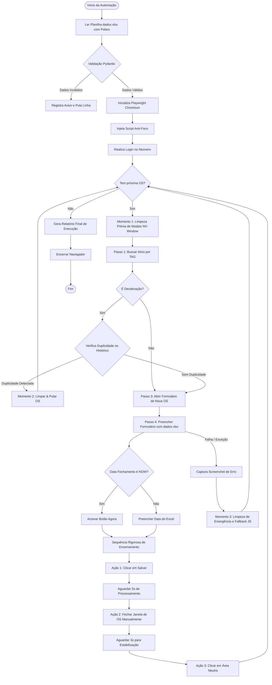

<div align="center">
  
  <h1>🤖 Automação de Ordens de Serviço - Neovero (Orbis)</h1>
  <p><i>Solução industrial e corporativa robusta de RPA desenvolvida em Python para abertura e fechamento em lote de O.S.</i></p>
  
  <p>
    <a href="#-visão-geral">Sobre</a> •
    <a href="#-principais-funcionalidades">Funcionalidades</a> •
    <a href="#-fluxo-de-processamento">Fluxo</a> •
    <a href="#-estrutura-do-projeto">Arquitetura</a> •
    <a href="#-modelo-de-dados-da-planilha-dadosxlsx">Dados</a> •
    <a href="#-instalação-e-configuração">Instalação</a> •
    <a href="#-como-usar">Como Usar</a> •
    <a href="#-engenharia-de-robustez--resiliência">Robustez</a>
  </p>

  <div>
    
    
    
    
    
    
  </div>
</div>

---

## 📌 Visão Geral

Este projeto consiste em uma ferramenta avançada de Engenharia de Automação para abertura e gestão em massa de Ordens de Serviço (O.S.) no sistema Neovero. A arquitetura foi desenhada para superar limitações comuns em sistemas legados, como instabilidade de sessão, carregamento complexo via múltiplos iframes aninhados e baixa performance na leitura de grandes volumes de dados.

---

## ✨ Principais Funcionalidades

*   🚀 **Performance de Dados (Polars/Rust)**: Processamento e sanitização de planilhas Excel em frações de segundo, com performance muito superior ao Pandas tradicional.
*   🏗️ **Page Object Model (POM)**: Código modular que separa os seletores e interações de cada tela (`LoginPage`, `MenuPage`, `EquipmentPage`, `OsPage`), reduzindo custos de manutenção.
*   🕵️‍♂️ **Algoritmo Caçador de Iframes (Iframe Hunter)**: Mecanismo de busca transversal recursiva que varre o frame principal e todos os iframes filhos (mesmo em domínios diferentes) para localizar botões ou campos.
*   🧼 **Estratégia State-Clean**: Reinicialização de escopo e remoção nativa/programática de modais para manter o ciclo de execução da automação limpo sem precisar recarregar (F5) o navegador a cada O.S.
*   🛡️ **Validação de Contrato (Pydantic)**: Tipagem estrita na leitura das linhas do Excel, bloqueando dados inválidos ou mal-formatados antes de inicializar o navegador físico.
*   🔒 **Injeção de Script Anti-Foco**: Impede o roubo de foco do mouse pelo navegador em execução, permitindo que o usuário trabalhe em outras janelas enquanto o bot opera em background.
*   📸 **Diagnóstico Automático (Screenshots e Logs)**: Monitoramento completo por arquivo ou console via `Loguru` e captura automática do navegador em caso de exceções críticas.

---

## 📊 Fluxo de Processamento

O fluxograma abaixo detalha a inteligência de negócios do robô, cobrindo o loop de processamento, checagem condicional de duplicidade e a sequência estrita de salvamento:



---

## 📁 Estrutura do Projeto

A arquitetura do diretório do projeto está organizada para separar a lógica de negócio das ferramentas de suporte técnico:

```
Bot-para-Preencher-OS/
├── 📂 data/                   # Armazenamento de dados e logs
│   ├── 📂 input/              # Pasta reservada para a planilha dados.xlsx
│   ├── 📂 output/             # Saída de relatórios gerados
│   └── 📂 logs/               # Registro de logs físicos (execution.log) e prints de falhas
├── 📂 src/                    # Código fonte da automação
│   ├── 📂 config/             # Configurações do projeto e do .env
│   │   └── settings.py        # Configurações globais via Pydantic Settings
│   ├── 📂 core/               # Inicialização de motores do bot
│   │   ├── browser.py         # Configuração de contexto e driver Playwright
│   │   └── exceptions.py      # Definição de exceções personalizadas de negócio
│   ├── 📂 pages/              # Mapeamento do Page Object Model (POM)
│   │   ├── equipment_page.py  # Tela de busca de ativos e leitura de históricos
│   │   ├── login_page.py      # Autenticação e navegação inicial
│   │   ├── menu_page.py       # Interação com menus e busca global
│   │   └── os_page.py         # Inserção de dados de OS, salvamento e fechamento
│   ├── 📂 services/           # Serviços de dados
│   │   └── excel_loader.py    # Leitura e parsing rápido com Polars e fastexcel
│   ├── 📂 utils/              # Funções de suporte gerais
│   │   ├── logger.py
│   │   └── timers.py
│   ├── main.py                # Orquestrador e fluxo principal do RPA
│   └── models.py              # Definição de schemas e validações com Pydantic
├── 📂 tests/                  # Testes unitários e funcionais
│   ├── test_loader.py
│   └── test_models.py
├── .env.example               # Exemplo de configuração de ambiente local
├── .gitignore                 # Arquivo de exclusões do Git
├── pyproject.toml             # Metadados e dependências no padrão PEP-621
└── requirements.txt           # Lista de dependências pip tradicionais
```

---

## 📋 Modelo de Dados da Planilha (`dados.xlsx`)

O arquivo Excel de entrada deve ser inserido na pasta `data/input/dados.xlsx`. Utilize o seguinte esquema de colunas:

| Coluna no Excel | Tipo de Dado | Obrigatório | Descrição / Exemplo |
| :--- | :---: | :---: | :--- |
| **Tag** | Texto | Sim | Identificador exclusivo do ativo no Neovero. Ex: `AC-01` |
| **Padrão** | Texto | Sim | Padrão correspondente do ativo. Ex: `AR CONDICIONADO` |
| **Data Início** | Data (`DD/MM/AAAA`) | Sim | Data de abertura do chamado. Ex: `20/05/2026` |
| **Hora Início** | Hora (`HH:MM`) | Sim | Horário de início do atendimento. Ex: `08:30` |
| **Hora Fim** | Hora / `NOW` | Sim | Hora do encerramento. Use `NOW` para marcar o horário atual. Ex: `17:45` ou `NOW` |
| **Tipo de Oficina** | Texto | Sim | Equipe executora da ordem. Ex: `MECÂNICA`, `REFRIGERAÇÃO` |
| **Tipo de Ordem** | Texto | Sim | Categoria da ordem. Ex: `PREVENTIVA`, `CORRETIVA`, `DESATIVAÇÃO` |
| **Complexidade** | Texto | Sim | Grau de criticidade da OS. Ex: `MÉDIA`, `ALTA` |
| **Reclamante** | Texto | Sim | Quem solicitou o serviço. Ex: `JOÃO SILVA` |
| **Tipo de Ocorrência** | Texto | Sim | Tipo de anomalia identificada. Ex: `FALHA OPERACIONAL` |
| **Causa da ocorrência** | Texto | Sim | Causa básica do problema. Ex: `DESGASTE NATURAL` |
| **Check Mão de Obra** | Booleano (`0` ou `1`) | Sim | Informa se a mão de obra já foi concluída. Ex: `1` |
| **Técnico Responsável**| Texto | Sim | Técnico principal alocado. Ex: `CARLOS ANDRADE` |
| **Serviço Realizado** | Texto | Sim | Detalhes do reparo feito. Ex: `LIMPEZA DE FILTRO E HIGIENIZAÇÃO` |
| **Observações** | Texto | Não | Descrição detalhada ou informações extras. |

---

## ⚙️ Instalação e Configuração

### 1. Clonar o Repositório
```bash
git clone https://github.com/g4bs2006/Bot-para-Preencher-OS.git
cd Bot-para-Preencher-OS
```

### 2. Configurar o Ambiente Virtual
Crie e ative um ambiente virtual para manter as dependências isoladas:
```bash
# Criar o ambiente virtual
python -m venv .venv

# Ativar no Windows (PowerShell)
.venv\Scripts\Activate.ps1

# Ativar no Linux/Mac
source .venv/bin/activate
```

### 3. Instalar Dependências e Navegador
```bash
pip install -r requirements.txt
playwright install chromium
```

### 4. Configurar as Variáveis de Ambiente
Copie o arquivo `.env.example` para `.env` e defina suas credenciais do Neovero:
```bash
cp .env.example .env
```
Abra o arquivo `.env` gerado e preencha as variáveis correspondentes:
```ini
NEOVERO_URL="https://orbis.neovero.com/login"
NEOVERO_USER="seu_usuario"
NEOVERO_PASS="sua_senha"
```

---

## 🚀 Como Usar

### Executar a Automação
Certifique-se de que a planilha `dados.xlsx` com as novas ordens de serviço esteja na pasta `data/input/` e execute:
```bash
python src/main.py
```
O progresso da execução, estatísticas de sucesso, falhas e alertas de duplicidade serão impressos diretamente no console.

### Executar Testes Unitários
Para validar as regras e transformações lógicas dos dados da planilha sem abrir o navegador:
```bash
pytest tests/
```

---

## 🛡️ Engenharia de Robustez & Resiliência

Para suportar a volatilidade estrutural e comportamental do Neovero, o robô conta com quatro mecanismos principais de tolerância a falhas:

1.  **Motor Transversal Iframe Hunter**:
    O Neovero renderiza suas telas usando uma árvore complexa de iframes dinâmicos. A automação localiza elementos em tempo real vasculhando todas as instâncias de frames carregadas no documento de forma transparente para o restante do código.
2.  **State-Clean Preventivo (Momento 1, 2 e 3)**:
    Antes de buscar um novo ativo e após salvar/falhar no preenchimento de uma OS, o bot fecha todas as janelas sobrepostas e modais do tipo `nv-window` voltando ao menu de busca principal.
3.  **Sanitização de Foco em Área Neutra**:
    Após a conclusão do fechamento das janelas de OS, o cursor do mouse realiza um clique sanitário na coordenada `(1,1)` da tela principal para desmarcar qualquer campo selecionado, evitando menus flutuantes que possam bloquear cliques na próxima OS.
4.  **Fallback de Limpeza via JavaScript**:
    Se uma janela travar devido a instabilidades da aplicação ou popups inesperados, impedindo que o clique nativo do botão fechar funcione, o bot injeta JavaScript diretamente no DOM para remover forçadamente elementos `<nv-window>` excedentes do documento.
